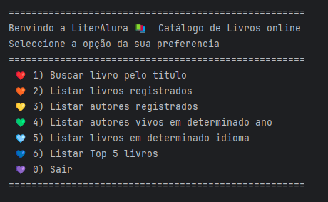

Challenge Catálogo de livros LiterAlura - Programa ONE(Oracle Next Education T6) && Alura - Especialização em back-end.
-----------------------------------------------------------------

### Bem-vindo a LiterAlura! 🌻
O Challenge tem como finalidade fazer um catálogo de livros em Java. O Programa tem interção com o usuário via console através de um menu com opções.
Para fazer o catálogo de livros foi preciso interagir com a API Gutendex (https://gutendex.com/) e salvar as informações de livros e autores num banco de dados feito em PostgreSQL. 
Foi usada a biblioteca Jackson Databind para desserializar o json da API nos modelos de negocio criados na app.

Funcionalidades do programa 📚
-----------------------------------------------------------------
   

Tecnologias utilizadas
-----------------------------------------------------------------
* Java 17
* Maven
* Spring Boot
* Jackson Databind
* Spring Data JPA
* Banco de dados PostgreSQL

