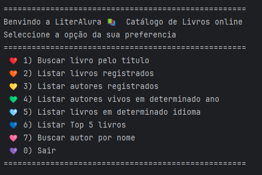
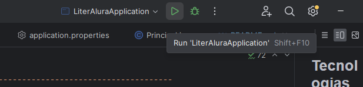

Challenge Catálogo de livros LiterAlura - Programa ONE(Oracle Next Education T6) && Alura - Especialização em back-end.
-----------------------------------------------------------------

### Bem-vindo a LiterAlura! 🌻
O Challenge tem como finalidade fazer um catálogo de livros usando a linguagem Java. O programa tem interação com o usuário via console através de um menu com opções.
Para fazer o catálogo de livros foi preciso interagir com a API Gutendex (https://gutendex.com/) e salvar as informações de livros e autores num banco de dados feito em PostgreSQL. 
Foi usada a biblioteca Jackson Databind para desserializar o json da API nos modelos de negocio criados na app.

Funcionalidades do programa 📚
-----------------------------------------------------------------
   

Tecnologias utilizadas
-----------------------------------------------------------------
* Java 17
* Maven
* Spring Boot
* Jackson Databind
* Spring Data JPA
* Banco de dados PostgreSQL

Instalação
-----------------------------------------------------------------
Será preciso que:

1) Clone este repositório: git clone https://github.com/mcruzr85/literAlura
2) Certifique-se de ter o Java JDK 8 ou superior instalado.
3) Importe o projeto em sua IDE preferida (IntelliJ IDEA ou Eclipse).
4) Instale e configure o PostgreSQL (precisa ter un Banco de Dados com o nome "literalura") 
5) Atualize as configurações no arquivo application.properties.
    (neste caso tem referencias a variavéis de entorno que vc precisa criar no seu computador)
6) Execute a classe LiteraluraApplication.java.

